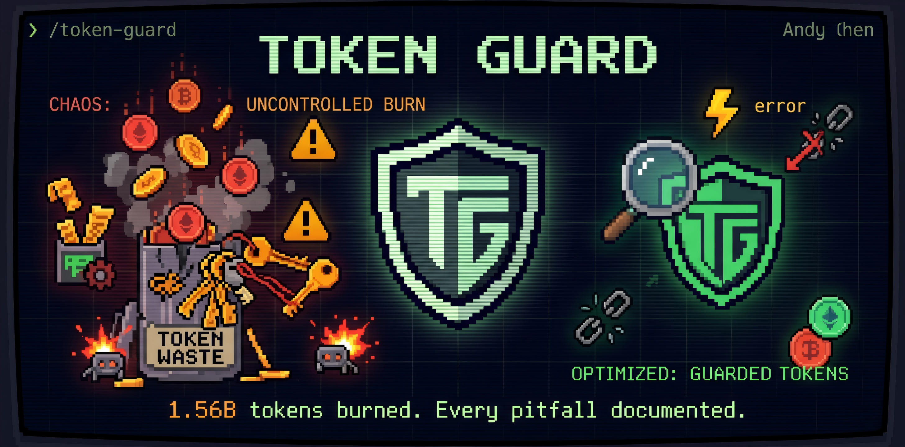

<div align="center">

中文 | <a href="README.md">English</a>



# Token Guard

**以身试法的通用 Tokens 节省指南 — 把该踩的坑都踩过了**

[](LICENSE)
[](https://github.com/Rubbish0-A/token-guard)
[](https://github.com/Rubbish0-A/token-guard)

[安装](#-安装) · [使用](#-使用) · [检查项](#-检查项) · [踩坑指南](#-踩坑指南)

</div>

---

<table>
<tr>
<td align="center"><strong>15.6 亿</strong><br><sub>16 天消耗 Tokens</sub></td>
<td align="center"><strong>9,000</strong><br><sub>API 请求数</sub></td>
<td align="center"><strong>$1,700+</strong><br><sub>费用</sub></td>
<td align="center"><strong>1.33 亿</strong><br><sub>输入 Tokens</sub></td>
</tr>
</table>

> 用 Opus 全力 vibe coding 半个月——然后我们问了一个问题：*tokens 都去哪了？*
>
> 这个插件就是答案。每一项检查、每一个踩坑经验、每一条优化建议，都是用真金白银换来的，来自对一个超高强度生产环境的系统性排查。

---

## 这是什么？

一个 **Claude Code 插件**，审计你的 token 消耗，精准定位钱花在了哪里。

不是纸上谈兵。所有内容来自真实重度使用环境——半个月消耗 **15.6 亿 tokens** 的实战排查。

### 隐形的成本爆炸

Claude Code 的 token 成本会因为隐蔽的配置问题悄然爆炸：

| 问题 | 影响 |
|------|------|
| 18 个插件全部启用 | 每次 API 调用注入 120+ 条技能描述（每轮浪费 ~15,000 tokens） |
| 插件三重复制 | 3 个插件注册完全相同的技能（pdf、docx、xlsx 各出现 3 次） |
| 强制 Agent 调度 | 规则强制每个任务派 3-5 个子 agent，每个都在 Opus 上重载完整系统提示 |
| API Key 交叉污染 | Anthropic 密钥存在 `GEMINI_API_KEY` 里，被发送到 Google 端点 |
| 会话膨胀 | 单个会话 78MB，记忆搜索 agent 膨胀到 15MB/个 |
| 无模型分档 | 所有子 agent 继承 Opus 定价，做 Haiku 能做的事 |

**优化前每轮系统提示开销 ~$0.52 → 优化后 ~$0.04 — 降低 93%。**

---

## ▸ 安装

```bash
claude plugin add Rubbish0-A/token-guard
```

<details>
<summary>手动安装</summary>

```bash
git clone git@github.com:Rubbish0-A/token-guard.git ~/.claude/plugins/local/token-guard
```

</details>

## ▸ 使用

```
/token-guard
```

Token Guard 扫描你的配置，输出带评分的审计报告：

<details>
<summary><strong>报告示例</strong></summary>

```
Token Guard 审计报告
═══════════════════════════════════════════════
评分：🟡 需要关注
检查时间：2026-04-16 14:30:00

──── 检查项 ────────────────────────────────────

✅ 模型配置：sonnet（日常开发推荐）
❌ 插件状态：18 个已启用，检测到 1 组重复
    → document-skills / example-skills / claude-api 注册相同技能
⚠️ 规则文件：19KB（建议 < 15KB）
    → 最大：skill-vetter.md(4699B), agents.md(1979B)
✅ 环境变量：未检测到交叉污染
✅ Thinking 预算：20000（合理）
⚠️ 危险模式：skipDangerousModePermissionPrompt=true
⚠️ 会话健康：总计 236MB，45 个 aside_question agent，最大 48MB

──── 影响估算 ──────────────────────────────────

系统提示开销：约 25,000 tokens/轮
  技能描述占：约 15,000 tokens（120 条 × ~125）
  规则文件占：约 6,000 tokens

──── 可修复项 ──────────────────────────────────

1. 禁用重复插件（每轮省 ~10,000 tokens）
2. 精简规则文件或转为按需加载
3. 清理旧会话数据（/compact 或开新会话）

═══════════════════════════════════════════════
```

</details>

## ▸ 检查项

| # | 检查项 | 检测内容 |
|:---:|--------|---------|
| 1 | **模型配置** | 是否用 Opus 做日常开发（成本是 Sonnet 的 5 倍） |
| 2 | **插件重复** | 插件过多、三重复制技能注册 |
| 3 | **规则文件体积** | 规则膨胀导致系统提示开销增大 |
| 4 | **环境变量安全** | API Key 存错变量（交叉污染） |
| 5 | **Thinking 预算** | Extended Thinking 预算过高（默认 31,999） |
| 6 | **危险模式** | `--dangerously-skip-permissions` 开启无限制执行 |
| 7 | **会话健康** | 会话膨胀、aside_question agent 膨胀、陈旧数据 |

### 自动化诊断脚本

内含 `scripts/audit.sh` — 跨平台 Bash 脚本，7 项检查输出结构化 JSON。Claude 读取后生成可读报告，脚本不可用时回退到手动检查。

<details>
<summary>JSON 输出示例</summary>

```json
{
  "tool": "token-guard",
  "version": "1.0.0",
  "results": [
    {"check": "model", "status": "warn", "value": "opus[1m]"},
    {"check": "plugins", "status": "warn", "enabled": 16, "duplicates": 0},
    {"check": "rules", "status": "warn", "totalKB": 19},
    {"check": "env_vars", "status": "fail", "issues": 2},
    {"check": "thinking", "status": "warn", "value": "31999"},
    {"check": "dangerous_mode", "status": "warn", "dangerousProcs": 3},
    {"check": "sessions", "status": "warn", "totalSizeMB": 236}
  ]
}
```

</details>

## ▸ 踩坑指南

8 章指南，全部基于真实事件。每章：发生了什么 → 为什么 → 消耗影响 → 规范做法。

| 章 | 标题 | 核心教训 |
|:---:|------|---------|
| 1 | **插件管理** | 所有技能描述每次调用都加载——即使你没用到 |
| 2 | **模型选择** | 用 Opus 做所有事 = 用火箭送外卖 |
| 3 | **规则文件** | 你写的每条规则，每轮对话都要付费 |
| 4 | **Thinking 预算** | 默认 31,999 → 大多数任务只用 < 5,000 |
| 5 | **安全与环境变量** | Key 存错变量 = Key 被发到错误的服务商 |
| 6 | **日常维护** | 配置只增不减——没有自动清理机制 |
| 7 | **会话管理** | git commit 才是跨会话记忆，不是长对话 |
| 8 | **子 Agent 失控** | "自动触发" = 3-5 个 agent × 完整系统提示 × Opus 定价 |

## ▸ 成本倍数参考

不含绝对价格——只用倍数关系，不随调价过时：

| 模型 | 输入 | 输出 | 适用场景 |
|------|:----:|:----:|---------|
| **Opus** | 5x | 5x | 架构设计、深度推理 |
| **Sonnet** | 1x | 1x | 日常编码、调试 |
| **Haiku** | ~0.27x | ~0.27x | 子 agent、检索、批处理 |

## ▸ 子 Agent 模型分档策略

| 任务 | 模型 | 升级到 Opus 的条件 |
|------|:----:|--------------------|
| 搜文件、git log | **Haiku** | 结果不可靠或存在矛盾 |
| CRUD、测试、简单重构 | **Sonnet** | 变更跨 3+ 个文件且有依赖 |
| Code review（小 diff） | **Sonnet** | 涉及认证、支付、安全、迁移 |
| 复杂编码、架构设计 | **Opus** | — |

## ▸ 新同事入职指南

包含 `onboarding-checklist.md` — 新同事入职当天就能用的配置清单，从第一天就避免浪费。

## 参与贡献

欢迎提 Issue 和 PR。发现了新的 token 消耗陷阱？[开个 issue](https://github.com/Rubbish0-A/token-guard/issues) — 我们会加到指南里。

## 协议

[MIT](LICENSE)

---

<div align="center">

**15.6 亿 tokens · $1,700 · 16 天**

*这里记录的每一个坑，都是真金白银踩出来的。*

**点个 Star，让别人不用再交同样的学费。**

</div>
